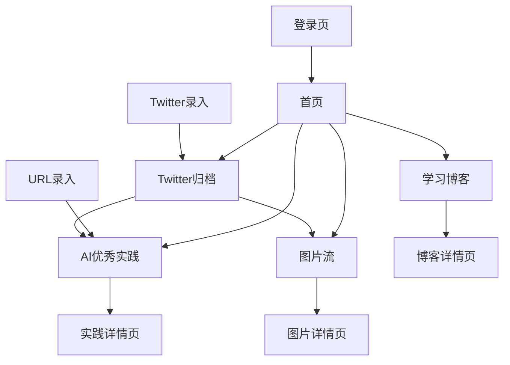

## 1. Product Overview
AIIndex 是一个黑白极简风格的个人 AI 知识库与内容聚合平台。它帮助用户收集、整理和管理 AI 相关的优秀实践、创意图片、学习笔记和社交媒体内容。

目标用户为 AI 从业者、设计师、开发者和内容创作者，通过智能化的内容抓取和分类，构建个人知识体系。

## 2. Core Features

### 2.1 User Roles
| Role | Registration Method | Core Permissions |
|------|---------------------|------------------|
| Visitor | 无需注册 | 浏览所有公开内容 |
| User | 邮箱注册/登录 | 创建、编辑、删除自己的内容 |

### 2.2 Feature Module
AIIndex 包含以下核心模块：

1. **AI 优秀实践**：展示 AI 相关优秀实践卡片，支持 URL 自动抓取和总结
2. **图片流**：瀑布流布局展示创意图片，支持大图查看和 Prompt 展示
3. **学习博客**：极简文字博客系统，支持 Markdown 渲染
4. **Twitter 归档**：自动抓取 Twitter 内容，支持筛选和归档到对应模块

### 2.3 Page Details
| Page Name | Module Name | Feature description |
|-----------|-------------|---------------------|
| 首页 | Header 导航 | 显示 AIIndex Logo，悬浮 Tab 切换各模块 |
| 首页 | AI 优秀实践列表 | 卡片式展示实践内容，包含标题、描述、Logo |
| 首页 | 图片流展示 | 瀑布流布局展示图片，支持点击查看大图 |
| 首页 | 学习博客列表 | 极简日期+标题列表展示 |
| 首页 | Twitter 归档 | 待处理推文列表，支持归档操作 |
| 详情页 | 实践详情 | 展示完整内容，登录用户可编辑 |
| 详情页 | 图片详情 | 大图展示，显示 Prompt 和描述 |
| 详情页 | 博客详情 | Markdown 内容渲染，大留白排版 |
| 录入页 | URL 录入 | 输入框支持 URL 抓取和自动总结 |
| 录入页 | Twitter 账号录入 | 输入 Twitter 账号进行内容抓取 |
| 登录页 | 用户认证 | 邮箱密码登录注册 |

## 3. Core Process

### 用户操作流程：
1. 访问首页，浏览各模块内容
2. 点击 Tab 切换不同模块，体验平滑动画过渡
3. 登录后可以添加新内容：
   - 输入 URL 自动抓取并生成实践卡片
   - 输入 Twitter 账号抓取并筛选优质内容
4. 在 Twitter 归档中处理推文，选择归档到实践或图片流
5. 查看详情时可以编辑内容信息

## 4. User Interface Design

### 4.1 Design Style
- **色彩方案**：严格黑白灰配色，#000000、#FFFFFF、#666666、#CCCCCC
- **字体系统**：系统默认无衬线字体，Inter 或 San Francisco
- **按钮样式**：极简矩形按钮，细边框或纯文字，hover 时轻微透明度变化
- **布局风格**：大量留白，卡片式内容展示，顶部悬浮导航
- **动效风格**：Framer Motion 实现，追求自然流畅的过渡效果

### 4.2 Page Design Overview
| Page Name | Module Name | UI Elements |
|-----------|-------------|-------------|
| 首页 | Header | AIIndex 粗体 Logo，悬浮 Tab 切换，字体粗细变化指示状态 |
| 首页 | 实践卡片 | 白色卡片，圆角 4px，阴影 #00000010，包含 Logo、标题、描述 |
| 首页 | 图片瀑布流 | Masonry 布局，图片间距 8px，圆角 4px |
| 详情页 | 内容区域 | 最大宽度 800px，行高 1.8，字体大小 16px，大留白 |
| 录入页 | 输入框 | 简洁输入框，细边框 #CCCCCC，聚焦时边框变粗 |

### 4.3 Responsiveness
- 桌面优先设计，响应式适配移动端
- 断点：768px（平板）、1024px（桌面）
- 移动端采用单列布局，保持极简风格

### 4.4 交互动效
- Tab 切换：Layout Animation 平滑过渡，200ms 持续时间
- 卡片加载：Staggered Fade Up 动画，逐个上浮显示
- 图片查看：Modal 淡入淡出，背景半透明遮罩
- 按钮反馈：点击时轻微缩放（0.98），hover 时透明度 0.8