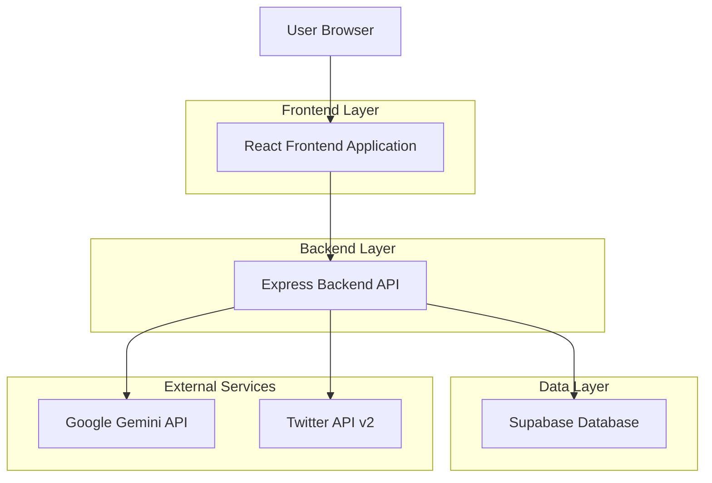
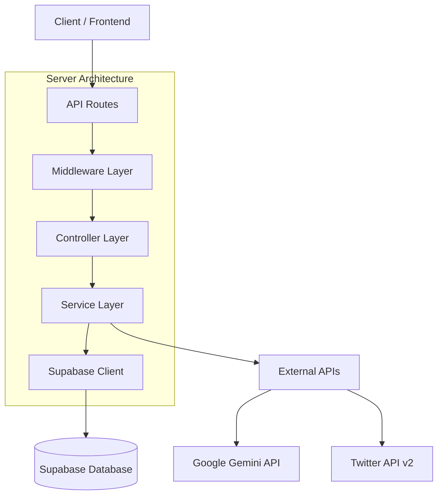
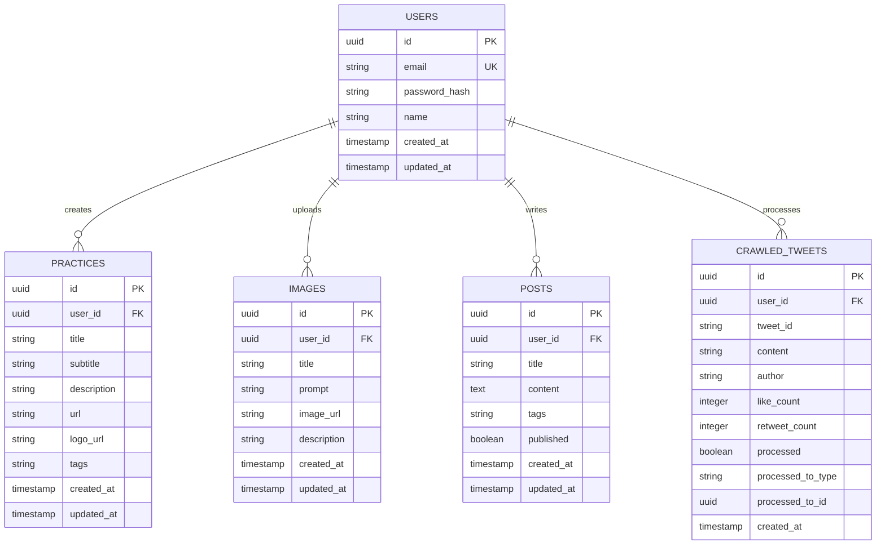

## 1. Architecture design



## 2. Technology Description
- Frontend: React@18 + Tailwind CSS@3 + Framer Motion + Masonry Layout
- Initialization Tool: vite-init
- Backend: Express@4 + Node.js
- Database: Supabase (PostgreSQL)
- AI Service: Google Gemini API
- Social API: Twitter API v2
- Deployment: Vercel

## 3. Route definitions
| Route | Purpose |
|-------|---------|
| / | 首页，展示所有模块内容 |
| /login | 登录页面，用户认证 |
| /practice/:id | AI优秀实践详情页 |
| /image/:id | 图片详情页 |
| /post/:id | 博客文章详情页 |
| /admin/practices | 实践管理页面 |
| /admin/images | 图片管理页面 |
| /admin/posts | 博客管理页面 |

## 4. API definitions

### 4.1 Authentication APIs
```
POST /api/auth/login
```
Request:
| Param Name | Param Type | isRequired | Description |
|------------|------------|------------|-------------|
| email | string | true | 用户邮箱 |
| password | string | true | 用户密码 |

Response:
| Param Name | Param Type | Description |
|------------|------------|-------------|
| token | string | JWT token |
| user | object | 用户信息 |

### 4.2 Practice APIs
```
GET /api/practices
POST /api/practices
PUT /api/practices/:id
DELETE /api/practices/:id
```

### 4.3 Image APIs
```
GET /api/images
POST /api/images
PUT /api/images/:id
DELETE /api/images/:id
```

### 4.4 Content Scraping APIs
```
POST /api/scrape/url
POST /api/scrape/twitter
```

Request (URL scraping):
| Param Name | Param Type | isRequired | Description |
|------------|------------|------------|-------------|
| url | string | true | 要抓取的URL |

Request (Twitter scraping):
| Param Name | Param Type | isRequired | Description |
|------------|------------|-------------|
| username | string | true | Twitter用户名 |

## 5. Server architecture diagram



## 6. Data model

### 6.1 Data model definition


### 6.2 Data Definition Language

#### Users Table
```sql
CREATE TABLE users (
  id UUID PRIMARY KEY DEFAULT gen_random_uuid(),
  email VARCHAR(255) UNIQUE NOT NULL,
  password_hash VARCHAR(255) NOT NULL,
  name VARCHAR(100) NOT NULL,
  created_at TIMESTAMP WITH TIME ZONE DEFAULT NOW(),
  updated_at TIMESTAMP WITH TIME ZONE DEFAULT NOW()
);

-- Indexes
CREATE INDEX idx_users_email ON users(email);
```

#### Practices Table
```sql
CREATE TABLE practices (
  id UUID PRIMARY KEY DEFAULT gen_random_uuid(),
  user_id UUID REFERENCES users(id) ON DELETE CASCADE,
  title VARCHAR(255) NOT NULL,
  subtitle VARCHAR(255),
  description TEXT,
  url VARCHAR(500),
  logo_url VARCHAR(500),
  tags VARCHAR(500),
  created_at TIMESTAMP WITH TIME ZONE DEFAULT NOW(),
  updated_at TIMESTAMP WITH TIME ZONE DEFAULT NOW()
);

-- Indexes
CREATE INDEX idx_practices_user_id ON practices(user_id);
CREATE INDEX idx_practices_created_at ON practices(created_at DESC);

-- Row Level Security
ALTER TABLE practices ENABLE ROW LEVEL SECURITY;
CREATE POLICY "Users can view all practices" ON practices FOR SELECT USING (true);
CREATE POLICY "Users can insert their own practices" ON practices FOR INSERT WITH CHECK (auth.uid() = user_id);
CREATE POLICY "Users can update their own practices" ON practices FOR UPDATE USING (auth.uid() = user_id);
CREATE POLICY "Users can delete their own practices" ON practices FOR DELETE USING (auth.uid() = user_id);

-- Grant permissions
GRANT SELECT ON practices TO anon;
GRANT ALL ON practices TO authenticated;
```

#### Images Table
```sql
CREATE TABLE images (
  id UUID PRIMARY KEY DEFAULT gen_random_uuid(),
  user_id UUID REFERENCES users(id) ON DELETE CASCADE,
  title VARCHAR(255) NOT NULL,
  prompt TEXT,
  image_url VARCHAR(500) NOT NULL,
  description TEXT,
  created_at TIMESTAMP WITH TIME ZONE DEFAULT NOW(),
  updated_at TIMESTAMP WITH TIME ZONE DEFAULT NOW()
);

-- Indexes
CREATE INDEX idx_images_user_id ON images(user_id);
CREATE INDEX idx_images_created_at ON images(created_at DESC);

-- Row Level Security
ALTER TABLE images ENABLE ROW LEVEL SECURITY;
CREATE POLICY "Users can view all images" ON images FOR SELECT USING (true);
CREATE POLICY "Users can insert their own images" ON images FOR INSERT WITH CHECK (auth.uid() = user_id);
CREATE POLICY "Users can update their own images" ON images FOR UPDATE USING (auth.uid() = user_id);
CREATE POLICY "Users can delete their own images" ON images FOR DELETE USING (auth.uid() = user_id);

-- Grant permissions
GRANT SELECT ON images TO anon;
GRANT ALL ON images TO authenticated;
```

#### Posts Table
```sql
CREATE TABLE posts (
  id UUID PRIMARY KEY DEFAULT gen_random_uuid(),
  user_id UUID REFERENCES users(id) ON DELETE CASCADE,
  title VARCHAR(255) NOT NULL,
  content TEXT NOT NULL,
  tags VARCHAR(500),
  published BOOLEAN DEFAULT true,
  created_at TIMESTAMP WITH TIME ZONE DEFAULT NOW(),
  updated_at TIMESTAMP WITH TIME ZONE DEFAULT NOW()
);

-- Indexes
CREATE INDEX idx_posts_user_id ON posts(user_id);
CREATE INDEX idx_posts_created_at ON posts(created_at DESC);
CREATE INDEX idx_posts_published ON posts(published) WHERE published = true;

-- Row Level Security
ALTER TABLE posts ENABLE ROW LEVEL SECURITY;
CREATE POLICY "Users can view published posts" ON posts FOR SELECT USING (published = true);
CREATE POLICY "Users can view their own posts" ON posts FOR SELECT USING (auth.uid() = user_id);
CREATE POLICY "Users can insert their own posts" ON posts FOR INSERT WITH CHECK (auth.uid() = user_id);
CREATE POLICY "Users can update their own posts" ON posts FOR UPDATE USING (auth.uid() = user_id);
CREATE POLICY "Users can delete their own posts" ON posts FOR DELETE USING (auth.uid() = user_id);

-- Grant permissions
GRANT SELECT ON posts TO anon;
GRANT ALL ON posts TO authenticated;
```

#### Crawled Tweets Table
```sql
CREATE TABLE crawled_tweets (
  id UUID PRIMARY KEY DEFAULT gen_random_uuid(),
  user_id UUID REFERENCES users(id) ON DELETE CASCADE,
  tweet_id VARCHAR(100) UNIQUE NOT NULL,
  content TEXT NOT NULL,
  author VARCHAR(100) NOT NULL,
  like_count INTEGER DEFAULT 0,
  retweet_count INTEGER DEFAULT 0,
  processed BOOLEAN DEFAULT false,
  processed_to_type VARCHAR(50),
  processed_to_id UUID,
  created_at TIMESTAMP WITH TIME ZONE DEFAULT NOW()
);

-- Indexes
CREATE INDEX idx_crawled_tweets_user_id ON crawled_tweets(user_id);
CREATE INDEX idx_crawled_tweets_processed ON crawled_tweets(processed);
CREATE INDEX idx_crawled_tweets_created_at ON crawled_tweets(created_at DESC);

-- Row Level Security
ALTER TABLE crawled_tweets ENABLE ROW LEVEL SECURITY;
CREATE POLICY "Users can view their own crawled tweets" ON crawled_tweets FOR SELECT USING (auth.uid() = user_id);
CREATE POLICY "Users can insert crawled tweets" ON crawled_tweets FOR INSERT WITH CHECK (auth.uid() = user_id);
CREATE POLICY "Users can update their own crawled tweets" ON crawled_tweets FOR UPDATE USING (auth.uid() = user_id);
CREATE POLICY "Users can delete their own crawled tweets" ON crawled_tweets FOR DELETE USING (auth.uid() = user_id);

-- Grant permissions
GRANT ALL ON crawled_tweets TO authenticated;
```