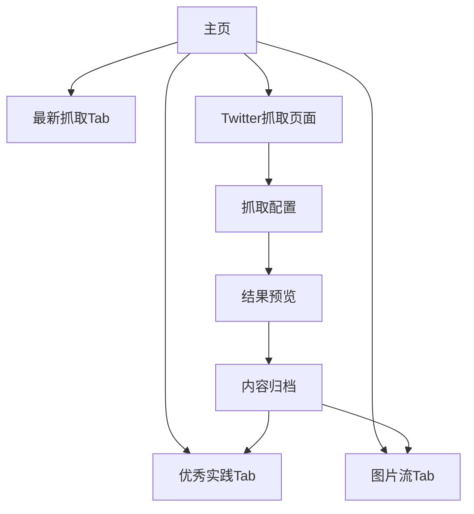

# 产品需求文档 - Twitter抓取功能与主页Tab化

## 1. 产品概述

本项目是一个内容聚合平台，通过Tab化展示不同模块内容，并新增Twitter抓取功能来收集优质内容。主要解决内容发现效率低、优质内容分散的问题，帮助用户快速获取高质量信息。

目标用户包括内容创作者、营销人员和信息收集者，通过自动化抓取和人工筛选相结合的方式提供价值。

## 2. 核心功能

### 2.1 用户角色

| 角色 | 注册方式 | 核心权限 |
|------|----------|----------|
| 普通用户 | 邮箱注册 | 浏览内容、使用Twitter抓取功能 |
| 管理员 | 后台创建 | 管理内容、审核抓取结果、配置抓取规则 |

### 2.2 功能模块

本项目包含以下主要功能模块：

1. **主页Tab化展示**：优秀实践、图片流、最新抓取等内容模块
2. **Twitter抓取功能**：基于关注列表的智能内容筛选
3. **内容归档管理**：抓取结果可选择性归档到不同模块
4. **抓取配置**：设置目标账号、筛选条件等参数

### 2.3 页面详情

| 页面名称 | 模块名称 | 功能描述 |
|----------|----------|----------|
| 主页 | Tab导航栏 | 切换优秀实践、图片流、最新抓取等标签页 |
| 主页 | 优秀实践Tab | 展示精选的高质量内容案例，支持搜索和筛选 |
| 主页 | 图片流Tab | 展示抓取的图片内容，支持瀑布流布局 |
| 主页 | 最新抓取Tab | 展示最近抓取的内容，按时间排序 |
| Twitter抓取 | 账号配置 | 输入目标Twitter账号，获取关注列表 |
| Twitter抓取 | 抓取设置 | 设置收藏数阈值（默认50）、抓取频率等参数 |
| Twitter抓取 | 结果预览 | 显示符合条件的推文列表，包含收藏数、转发数等数据 |
| Twitter抓取 | 内容归档 | 选择将抓取结果归档到优秀实践或图片流 |
| 抓取历史 | 历史记录 | 查看过往抓取任务和结果统计 |

## 3. 核心流程

### 3.1 Twitter抓取流程

用户配置目标账号 → 系统获取关注列表 → 筛选高收藏内容 → 用户预览结果 → 选择归档位置 → 内容入库展示

### 3.2 页面导航流程

## 4. 用户界面设计

### 4.1 设计风格

- **主色调**：蓝色系（#1DA1F2）呼应Twitter品牌色
- **辅助色**：灰色系（#657786, #AAB8C2）用于文字和边框
- **按钮样式**：圆角矩形，悬停效果
- **字体**：系统默认字体，标题16px，正文14px
- **布局风格**：卡片式布局，响应式网格
- **图标风格**：线性图标，简洁现代

### 4.2 页面设计概览

| 页面名称 | 模块名称 | UI元素 |
|----------|----------|--------|
| 主页 | Tab导航栏 | 顶部横向Tab，当前选中高亮显示，支持滑动切换 |
| 主页 | 优秀实践Tab | 卡片网格布局，每张卡片显示标题、摘要、收藏数、发布时间 |
| 主页 | 图片流Tab | 瀑布流布局，图片自适应宽度，悬停显示详细信息 |
| 主页 | 最新抓取Tab | 列表布局，按时间倒序排列，显示内容预览和操作按钮 |
| Twitter抓取 | 账号输入 | 文本输入框，支持多个账号，逗号分隔 |
| Twitter抓取 | 抓取按钮 | 主要操作按钮，蓝色背景，显示加载状态 |
| Twitter抓取 | 结果列表 | 表格形式展示推文数据，包含选择框用于归档 |

### 4.3 响应式设计

- **桌面优先**：默认设计为桌面端，支持1200px以上宽度
- **移动端适配**：768px以下切换为移动端布局，Tab改为底部导航
- **触摸优化**：移动端增大点击区域，支持左右滑动切换Tab

### 4.4 降级策略

当Twitter API不可用或受限时：
- 显示友好的错误提示
- 提供手动导入功能
- 缓存历史数据供离线查看
- 支持从RSS源或其他社交媒体平台抓取备选内容

## 5. 性能与限制

- **抓取频率**：每个账号每小时最多抓取10次
- **单次抓取**：最多处理1000条推文
- **存储限制**：每个用户最多保存5000条归档内容
- **响应时间**：页面加载时间不超过3秒
- **并发处理**：支持同时处理5个抓取任务