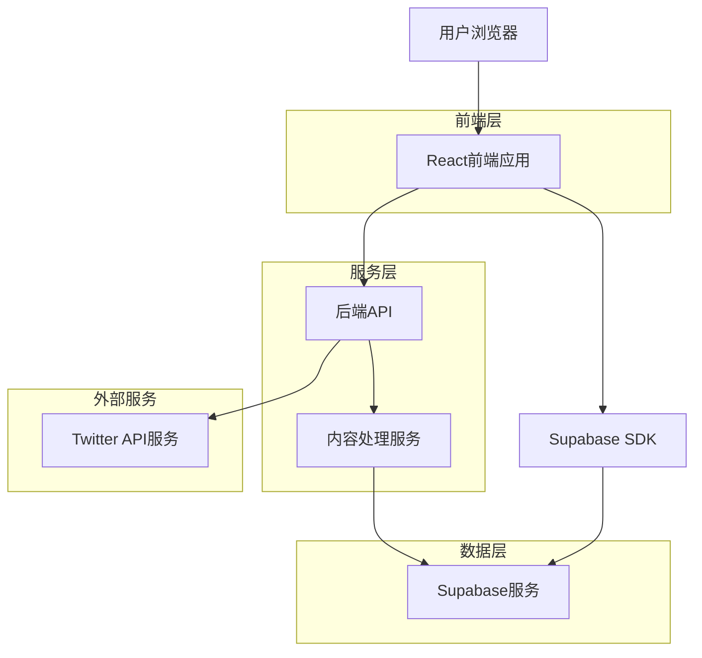
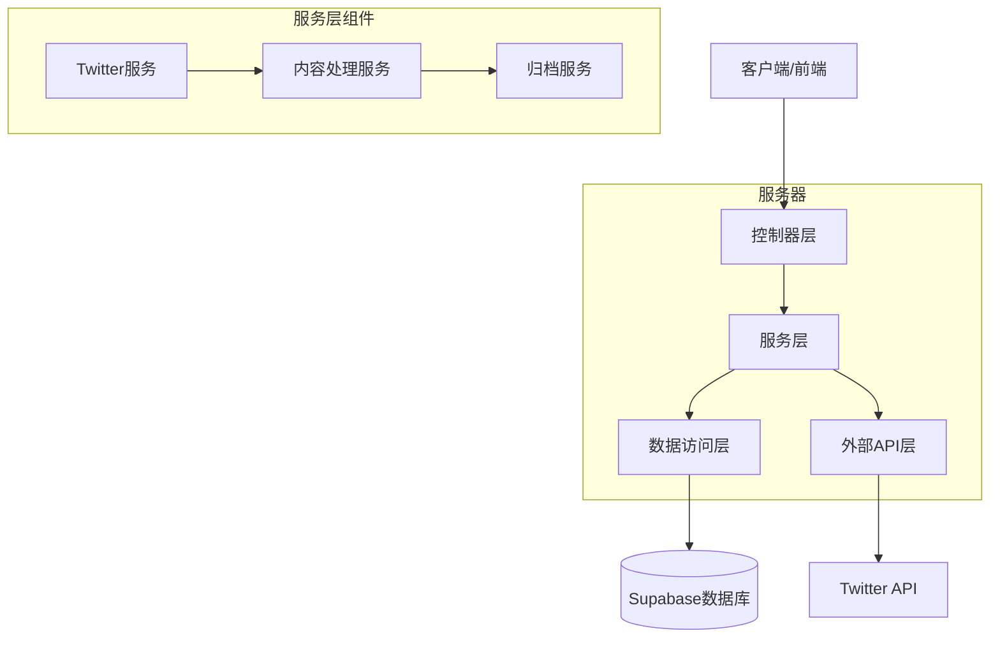
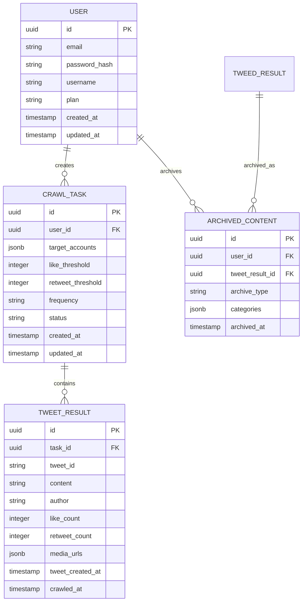

# 技术架构文档 - Twitter抓取功能与主页Tab化

## 1. 架构设计



## 2. 技术描述

- **前端**: React@18 + tailwindcss@3 + vite
- **初始化工具**: vite-init
- **后端**: Express@4 + Node.js
- **数据库**: Supabase (PostgreSQL)
- **外部API**: Twitter API v2

## 3. 路由定义

| 路由 | 用途 |
|------|------|
| / | 主页，显示Tab化内容模块 |
| /best-practices | 优秀实践Tab页面 |
| /image-stream | 图片流Tab页面 |
| /latest-crawls | 最新抓取Tab页面 |
| /twitter-crawler | Twitter抓取配置页面 |
| /crawl-results | 抓取结果预览页面 |
| /crawl-history | 抓取历史记录页面 |
| /login | 用户登录页面 |
| /register | 用户注册页面 |

## 4. API定义

### 4.1 核心API

#### Twitter抓取配置
```
POST /api/twitter/configure
```

请求参数：
| 参数名 | 参数类型 | 是否必需 | 描述 |
|--------|----------|----------|------|
| targetAccounts | string[] | 是 | 目标Twitter账号列表 |
| likeThreshold | number | 否 | 收藏数阈值，默认50 |
| retweetOriginalLikes | number | 否 | 转推原帖收藏数阈值，默认50 |
| crawlFrequency | string | 否 | 抓取频率（hourly, daily, weekly） |

响应：
| 参数名 | 参数类型 | 描述 |
|--------|----------|------|
| status | boolean | 配置状态 |
| taskId | string | 任务ID |
| message | string | 状态信息 |

#### 开始抓取任务
```
POST /api/twitter/crawl
```

请求参数：
| 参数名 | 参数类型 | 是否必需 | 描述 |
|--------|----------|----------|------|
| taskId | string | 是 | 任务ID |

响应：
| 参数名 | 参数类型 | 描述 |
|--------|----------|------|
| status | boolean | 抓取状态 |
| results | object[] | 抓取到的推文列表 |
| totalCount | number | 总数量 |

#### 内容归档
```
POST /api/content/archive
```

请求参数：
| 参数名 | 参数类型 | 是否必需 | 描述 |
|--------|----------|----------|------|
| contentId | string | 是 | 内容ID |
| archiveType | string | 是 | 归档类型（best-practices, image-stream） |
| category | string | 否 | 分类标签 |

响应：
| 参数名 | 参数类型 | 描述 |
|--------|----------|------|
| status | boolean | 归档状态 |
| archivedId | string | 归档记录ID |

## 5. 服务器架构图



## 6. 数据模型

### 6.1 数据模型定义



### 6.2 数据定义语言

#### 用户表 (users)
```sql
-- 创建用户表
CREATE TABLE users (
    id UUID PRIMARY KEY DEFAULT gen_random_uuid(),
    email VARCHAR(255) UNIQUE NOT NULL,
    username VARCHAR(100) UNIQUE NOT NULL,
    password_hash VARCHAR(255) NOT NULL,
    plan VARCHAR(20) DEFAULT 'free' CHECK (plan IN ('free', 'premium')),
    created_at TIMESTAMP WITH TIME ZONE DEFAULT NOW(),
    updated_at TIMESTAMP WITH TIME ZONE DEFAULT NOW()
);

-- 创建索引
CREATE INDEX idx_users_email ON users(email);
CREATE INDEX idx_users_username ON users(username);
```

#### 抓取任务表 (crawl_tasks)
```sql
-- 创建抓取任务表
CREATE TABLE crawl_tasks (
    id UUID PRIMARY KEY DEFAULT gen_random_uuid(),
    user_id UUID NOT NULL REFERENCES users(id) ON DELETE CASCADE,
    target_accounts JSONB NOT NULL,
    like_threshold INTEGER DEFAULT 50,
    retweet_threshold INTEGER DEFAULT 50,
    frequency VARCHAR(20) DEFAULT 'daily' CHECK (frequency IN ('hourly', 'daily', 'weekly')),
    status VARCHAR(20) DEFAULT 'pending' CHECK (status IN ('pending', 'running', 'completed', 'failed')),
    created_at TIMESTAMP WITH TIME ZONE DEFAULT NOW(),
    updated_at TIMESTAMP WITH TIME ZONE DEFAULT NOW()
);

-- 创建索引
CREATE INDEX idx_crawl_tasks_user_id ON crawl_tasks(user_id);
CREATE INDEX idx_crawl_tasks_status ON crawl_tasks(status);
```

#### 推文结果表 (tweet_results)
```sql
-- 创建推文结果表
CREATE TABLE tweet_results (
    id UUID PRIMARY KEY DEFAULT gen_random_uuid(),
    task_id UUID NOT NULL REFERENCES crawl_tasks(id) ON DELETE CASCADE,
    tweet_id VARCHAR(100) UNIQUE NOT NULL,
    content TEXT NOT NULL,
    author VARCHAR(100) NOT NULL,
    like_count INTEGER DEFAULT 0,
    retweet_count INTEGER DEFAULT 0,
    media_urls JSONB DEFAULT '[]',
    tweet_created_at TIMESTAMP WITH TIME ZONE NOT NULL,
    crawled_at TIMESTAMP WITH TIME ZONE DEFAULT NOW()
);

-- 创建索引
CREATE INDEX idx_tweet_results_task_id ON tweet_results(task_id);
CREATE INDEX idx_tweet_results_like_count ON tweet_results(like_count DESC);
CREATE INDEX idx_tweet_results_created_at ON tweet_results(tweet_created_at DESC);
```

#### 归档内容表 (archived_content)
```sql
-- 创建归档内容表
CREATE TABLE archived_content (
    id UUID PRIMARY KEY DEFAULT gen_random_uuid(),
    user_id UUID NOT NULL REFERENCES users(id) ON DELETE CASCADE,
    tweet_result_id UUID NOT NULL REFERENCES tweet_results(id) ON DELETE CASCADE,
    archive_type VARCHAR(50) NOT NULL CHECK (archive_type IN ('best-practices', 'image-stream')),
    categories JSONB DEFAULT '[]',
    archived_at TIMESTAMP WITH TIME ZONE DEFAULT NOW()
);

-- 创建索引
CREATE INDEX idx_archived_content_user_id ON archived_content(user_id);
CREATE INDEX idx_archived_content_type ON archived_content(archive_type);
CREATE INDEX idx_archived_content_archived_at ON archived_content(archived_at DESC);

-- 确保同一推文不会被重复归档
CREATE UNIQUE INDEX idx_archived_content_unique ON archived_content(user_id, tweet_result_id, archive_type);
```

### 6.3 权限设置

```sql
-- 为匿名用户授予基本读取权限
GRANT SELECT ON users TO anon;
GRANT SELECT ON crawl_tasks TO anon;
GRANT SELECT ON tweet_results TO anon;
GRANT SELECT ON archived_content TO anon;

-- 为认证用户授予完整权限
GRANT ALL PRIVILEGES ON users TO authenticated;
GRANT ALL PRIVILEGES ON crawl_tasks TO authenticated;
GRANT ALL PRIVILEGES ON tweet_results TO authenticated;
GRANT ALL PRIVILEGES ON archived_content TO authenticated;
```

## 7. 降级策略实现

### 7.1 API降级处理
```javascript
// 当Twitter API不可用时，使用缓存数据
const fallbackToCache = async (userId) => {
    const cachedData = await supabase
        .from('tweet_results')
        .select('*')
        .order('crawled_at', { ascending: false })
        .limit(100);
    
    return cachedData.data;
};
```

### 7.2 手动导入功能
```javascript
// 支持手动导入推文数据
const manualImport = async (tweetData) => {
    const result = await supabase
        .from('tweet_results')
        .insert({
            tweet_id: tweetData.id,
            content: tweetData.text,
            author: tweetData.author,
            like_count: tweetData.likes,
            retweet_count: tweetData.retweets,
            tweet_created_at: tweetData.created_at
        });
    
    return result;
};
```