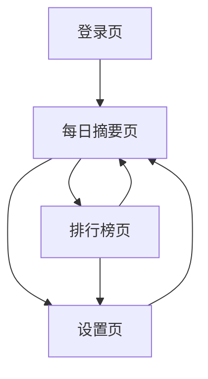

## 1. 产品概述
每日自动获取用户关注的X(Twitter)推文，通过AI分析识别高讨论度内容和优质作者，进行情绪分析，生成每日摘要和排行榜，帮助用户快速了解关注领域的热点动态。

目标用户：需要高效获取Twitter信息的商务人士、研究人员、内容创作者，解决信息过载问题，提供智能化的内容筛选和分析服务。

## 2. 核心功能

### 2.1 用户角色
| 角色 | 注册方式 | 核心权限 |
|------|----------|----------|
| 普通用户 | 邮箱注册 | 查看每日摘要、基础排行榜、设置关注关键词 |
| 高级用户 | 付费升级 | 自定义分析维度、导出报告、设置多个监控列表、API访问 |

### 2.2 功能模块
产品包含以下主要页面：
1. **登录注册页**：用户认证、Twitter账号绑定、订阅管理。
2. **每日摘要页**：今日热点概览、情绪分析图表、关键词云、热门推文展示。
3. **排行榜页**：作者排行榜、话题排行榜、互动量统计、影响力评分。
4. **设置页**：关注列表管理、通知设置、分析偏好、账号配置。

### 2.3 页面详情
| 页面名称 | 模块名称 | 功能描述 |
|-----------|----------|----------|
| 登录注册页 | 用户认证 | 邮箱登录注册、密码重置、Twitter OAuth绑定。 |
| 登录注册页 | 订阅管理 | 显示当前套餐、升级降级、支付管理。 |
| 每日摘要页 | 今日概览 | 显示日期、分析推文总数、情绪分布、热门话题。 |
| 每日摘要页 | 情绪分析 | 正面/负面/中性情绪占比图表、情绪变化趋势。 |
| 每日摘要页 | 关键词云 | 高频关键词可视化展示、点击筛选相关推文。 |
| 每日摘要页 | 热门推文 | 按互动量排序的热门推文列表、显示作者和摘要。 |
| 排行榜页 | 作者排行 | 基于互动量和正面情绪的综合评分排名。 |
| 排行榜页 | 话题排行 | 热门话题讨论度排名、相关推文数量。 |
| 排行榜页 | 统计详情 | 详细的数据图表、趋势分析、对比功能。 |
| 设置页 | 关注管理 | 添加/删除关注的Twitter用户、分组管理。 |
| 设置页 | 通知设置 | 邮件通知频率、推送时间、摘要格式设置。 |
| 设置页 | 分析偏好 | 情绪分析敏感度、过滤条件、语言偏好。 |

## 3. 核心流程

### 用户主要操作流程：
1. **注册登录流程**：用户注册 → 邮箱验证 → Twitter授权 → 选择关注用户 → 完成设置
2. **每日使用流程**：登录系统 → 查看每日摘要 → 浏览排行榜 → 深度分析感兴趣内容
3. **设置管理流程**：进入设置 → 管理关注列表 → 调整分析参数 → 设置通知偏好

## 4. 用户界面设计

### 4.1 设计风格
- **主色调**：深蓝色(#1DA1F2)呼应Twitter品牌，搭配白色背景和中性灰色
- **按钮样式**：圆角矩形设计，主要操作为实心填充，次要操作为边框样式
- **字体选择**：系统默认字体，标题16-20px，正文14px，小字12px
- **布局风格**：卡片式布局，顶部导航栏，侧边栏用于筛选和设置
- **图标风格**：使用简洁的线性图标，保持视觉一致性

### 4.2 页面设计概览
| 页面名称 | 模块名称 | UI元素 |
|-----------|----------|---------|
| 每日摘要页 | 今日概览 | 顶部统计卡片、情绪饼图、关键词云图、时间选择器 |
| 每日摘要页 | 热门推文 | 推文卡片列表、作者头像、互动数据、情绪标签 |
| 排行榜页 | 作者排行 | 排名表格、作者信息、影响力分数、趋势箭头 |
| 设置页 | 关注管理 | 用户列表、搜索框、批量操作按钮、分组标签 |

### 4.3 响应式设计
桌面端优先设计，适配平板和手机端：
- 桌面端：完整功能展示，多栏布局
- 平板端：简化导航，优化图表显示
- 手机端：单栏布局，底部导航，触摸友好的大按钮

### 4.4 数据可视化指导
- **情绪分析图表**：使用渐变色彩的饼图和折线图
- **排行榜展示**：清晰的排名数字和进度条
- **关键词云**：字体大小反映词频，色彩区分情绪倾向
- **趋势图表**：时间轴设计，支持缩放和筛选交互

