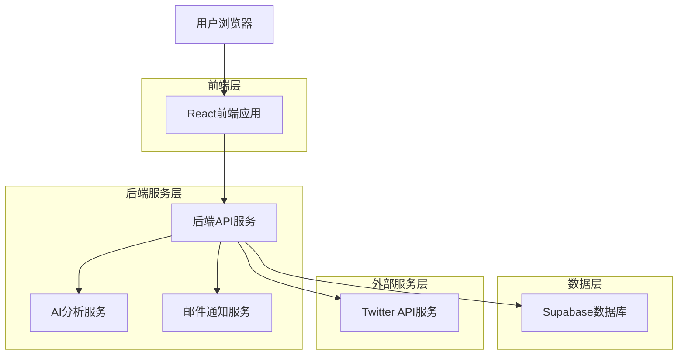
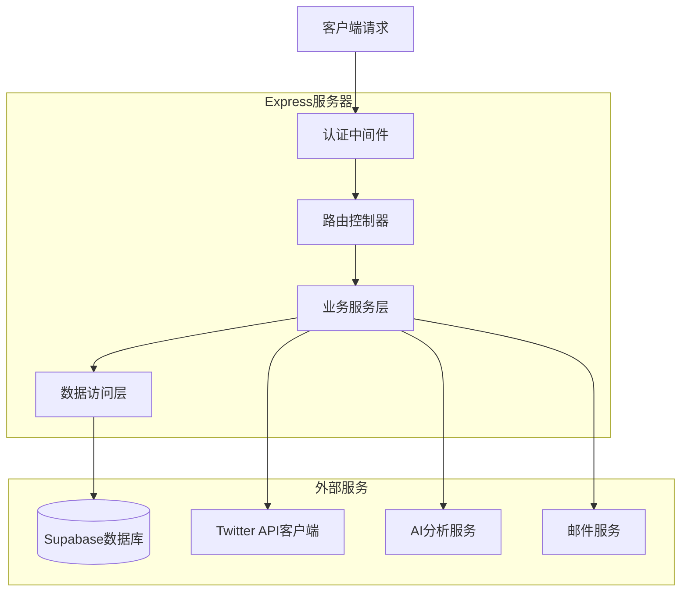
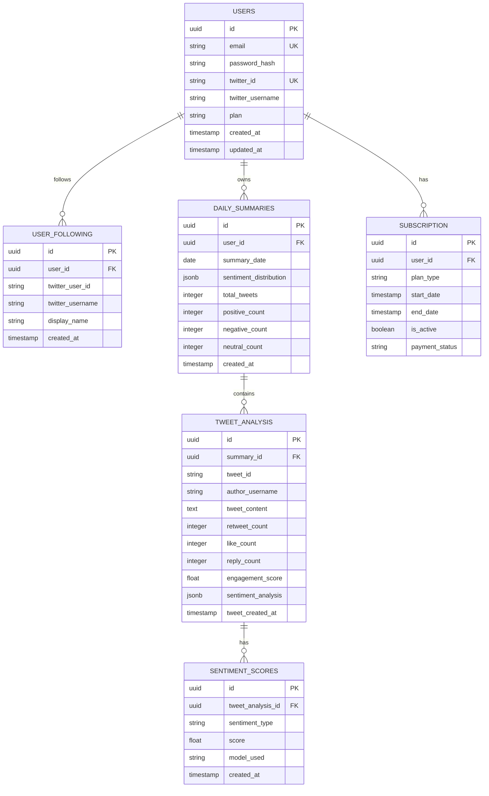

## 1. 架构设计



## 2. 技术描述

- **前端**: React@18 + TypeScript + TailwindCSS@3 + Vite
- **初始化工具**: vite-init
- **后端**: Node.js@18 + Express@4 + TypeScript
- **数据库**: Supabase (PostgreSQL)
- **身份验证**: Supabase Auth + Twitter OAuth
- **任务调度**: node-cron
- **AI分析**: OpenAI API / Hugging Face
- **邮件服务**: Nodemailer + SendGrid

## 3. 路由定义

| 路由 | 用途 |
|-------|---------|
| / | 登录页，用户认证入口 |
| /dashboard | 每日摘要页，显示分析结果 |
| /rankings | 排行榜页，展示作者和话题排名 |
| /settings | 设置页，管理关注列表和偏好 |
| /profile | 用户资料页，管理账号信息 |
| /api/auth/* | 认证相关API路由 |
| /api/twitter/* | Twitter数据获取API |
| /api/analytics/* | 分析结果API |

## 4. API定义

### 4.1 认证API

**用户登录**
```
POST /api/auth/login
```

请求参数：
| 参数名 | 参数类型 | 是否必需 | 描述 |
|-----------|-------------|-------------|-------------|
| email | string | true | 用户邮箱地址 |
| password | string | true | 用户密码 |

响应：
| 参数名 | 参数类型 | 描述 |
|-----------|-------------|-------------|
| token | string | JWT访问令牌 |
| user | object | 用户信息对象 |
| expiresIn | number | 令牌有效期（秒） |

### 4.2 Twitter数据API

**获取关注用户推文**
```
GET /api/twitter/following-tweets
```

请求头：
```
Authorization: Bearer {jwt_token}
```

查询参数：
| 参数名 | 参数类型 | 是否必需 | 描述 |
|-----------|-------------|-------------|-------------|
| date | string | false | 日期（YYYY-MM-DD），默认当天 |
| limit | number | false | 返回数量限制，默认50 |

响应：
| 参数名 | 参数类型 | 描述 |
|-----------|-------------|-------------|
| tweets | array | 推文对象数组 |
| totalCount | number | 推文总数 |
| analysisDate | string | 分析日期 |

### 4.3 分析结果API

**获取每日摘要**
```
GET /api/analytics/daily-summary
```

请求头：
```
Authorization: Bearer {jwt_token}
```

查询参数：
| 参数名 | 参数类型 | 是否必需 | 描述 |
|-----------|-------------|-------------|-------------|
| date | string | false | 摘要日期，默认昨天 |

响应：
| 参数名 | 参数类型 | 描述 |
|-----------|-------------|-------------|
| summary | object | 摘要数据对象 |
| sentiment | object | 情绪分析结果 |
| keywords | array | 关键词数组 |
| topAuthors | array | 热门作者数组 |

## 5. 服务器架构图



## 6. 数据模型

### 6.1 数据模型定义



### 6.2 数据定义语言

请参考 `trans/supabase/README.md` 中的迁移文件路径。

## 7. 定时任务配置

示例：每日凌晨2点执行推文获取与分析、每周日凌晨3点清理过期数据。

